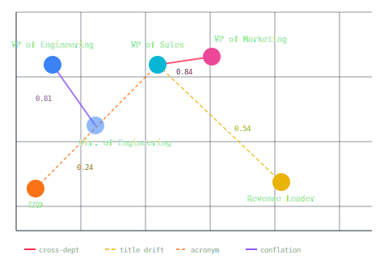

# Embedding Blind Spots — Five ways OpenAI embeddings distort job titles.

  

A live diagnostics sandbox for OpenAI title embeddings. Builds an NxN cosine similarity matrix across 35+ job titles and surfaces five systematic failure modes — with cosine scores for each.



## What This Exposes

| Failure Pattern | How This Project Surfaces It |
|---|---|
| **Functional Title Drift** | Titles without anchor tokens like `VP` or `Director` drift away from their expected cluster, measurably quantified per title |
| **Cross-Departmental Over-Similarity** | The model produces false-positive matches (`VP of Sales` ↔ `VP of Marketing` at **0.84**) that would cause incorrect results in any threshold-based matching pipeline |
| **Seniority Conflation** | A **0.05 delta** separates a seniority boundary from a departmental one; a system calibrated on small data would fail systematically across thousands of titles |
| **Syntactic Format Sensitivity** | The model clusters by surface form as much as by meaning — `"VP of X"` titles score higher with each other than with semantically equivalent `"X VP"` titles (**0.74** vs **0.55**) |
| **Acronym Blindspot** | `CRO` is ambiguous (`Chief Revenue Officer? Chief Risk Officer? Contract Research Org?`) so the embedding averages across meanings and collapses to **0.16–0.41**, while `Chief Revenue Officer` scores **0.50+** — proving that acronym expansion before embedding is mandatory |


*Cosine similarity matrix (left) · Failure mode breakdown (right)*

## Key Findings

### Areas of Success

| Pair | Score | Signal |
|---|---|---|
| *HR VP / VP HR / VP of HR* | **0.80–0.85** | Word order doesn't change the role — the model gets this right |
| *Director of Engineering* ↔ *VP of Engineering* | **0.79** | Adjacent seniority, same department — strong relationship maintained |

### Failure Cases

#### 🔤 Acronym Blindspot
`CRO` is ambiguous across four expansions — the embedding averages across meanings and collapses into noise. Any pipeline that skips acronym expansion will systematically fail to match C-suite roles.

| Pair | Score | Note |
|---|---|---|
| *Chief Revenue Officer* vs. other executive titles | **0.50+** | Expanded form scores normally |
| *CRO* vs. *VP of Sales* | **0.24** | *Same role, acronym form — lower than unrelated Software Engineer (**0.34**)* |

#### 🔡 Syntactic Format Sensitivity
The model clusters by grammatical pattern as much as by meaning — `"VP of X"` titles score higher with each other than with semantically equivalent `"X VP"` titles.

| Pair | Score | Note |
|---|---|---|
| *VP of Engineering* ↔ *VP of Finance* | **0.74** | *Same format, different dept* |
| *VP of Engineering* ↔ *Finance VP* | **0.55** | *Different format, different dept* |

#### 🏢 Cross-Departmental Over-Similarity
The model over-indexes on seniority tokens like `VP`, collapsing functional boundaries between unrelated departments.

| Pair | Score | Note |
|---|---|---|
| *VP of Sales* ↔ *VP of Marketing* | **0.84** | *Different dept — higher than many same-title word-order variants* |

#### 📊 Seniority Conflation
VP and Director are separated by the same margin as VPs across departments — a **0.05 delta** is the only thing between a seniority boundary and a departmental one.

| Pair | Score | Note |
|---|---|---|
| *VP of Engineering* ↔ *Director of Engineering* | **0.79** | *Same dept, different level* |
| *VP of Engineering* ↔ *VP of Finance* | **0.74** | *Same level, different dept* |

#### 🌀 Functional Title Drift
Non-canonical titles drift from their formal equivalents. `VP` and `Director` anchor embeddings toward executive space; titles without those tokens drift to a weak centroid.

| Pair | Score | Note |
|---|---|---|
| *Revenue Leader* ↔ *VP of Sales* | **0.54** | *Same role — VP of Marketing (different dept) scores **0.84** against the same title* |
| *Head of People* ↔ *VP of HR* | **0.60** | *Same function, same level* |
| *Sales Principal* vs. cross-domain VP titles | **< 0.40** | *Despite seniority level 4* |

## Conclusion
Raw embeddings provide a strong baseline for functional grouping but fail at **precise entity resolution** and **seniority mapping**. The five failure modes above are not edge cases — they reflect systematic gaps that appear whenever titles deviate from a canonical `"[Level] of [Department]"` format. A production title-matching system needs at minimum: acronym expansion, title normalization, and a seniority signal that does not rely on the embedding alone.

## Quick Start

**No API key needed** — embedding vectors are pre-calculated and committed. The matrix loads immediately.

```bash
npm install
npm run dev       # → http://localhost:3000
```

### Extend It

Rename `.env.example` to `.env.local`, add your OpenAI API key, add titles to `src/data/library.json`, then:

```bash
npm run seed    # generate embeddings for any titles with empty vectors
npm run clear   # wipe all vector data (useful for resetting to a clean state)
```

## Methodology
- **Model:** OpenAI text-embedding-3-small
- **Metric:** Cosine Similarity [0.0 - 1.0]
- **Dataset:** 35+ professional job titles across Engineering, Finance, HR, Legal, Marketing, and Sales.

*All scores are properties of `text-embedding-3-small`'s vector space — switching models requires full re-embedding, as a different model may resolve some failure modes while introducing others.*

---


*Full NxN cosine similarity matrix — all 46 job titles*
